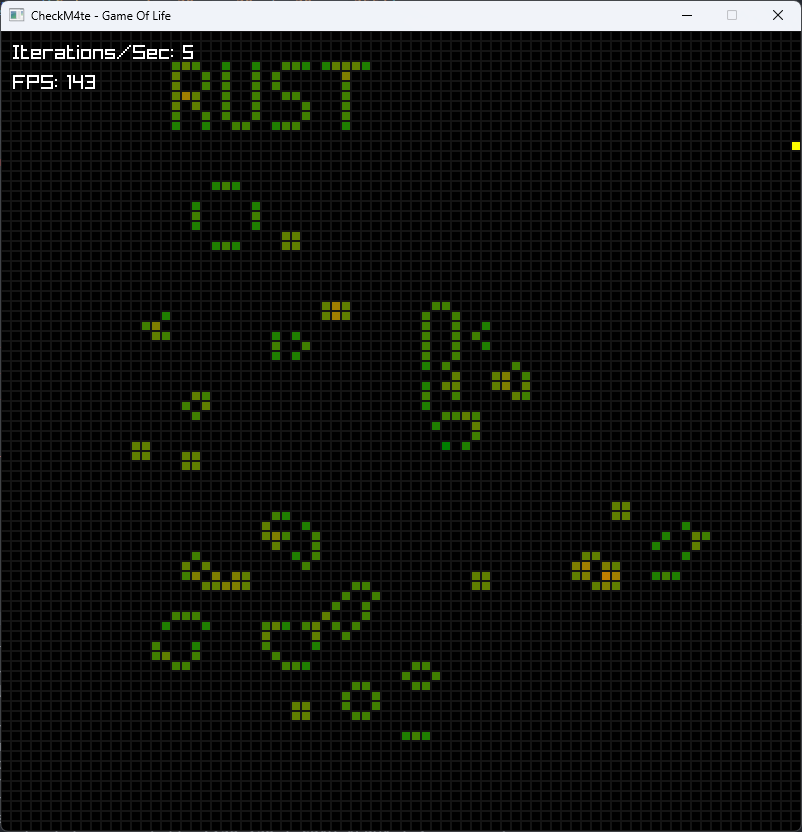
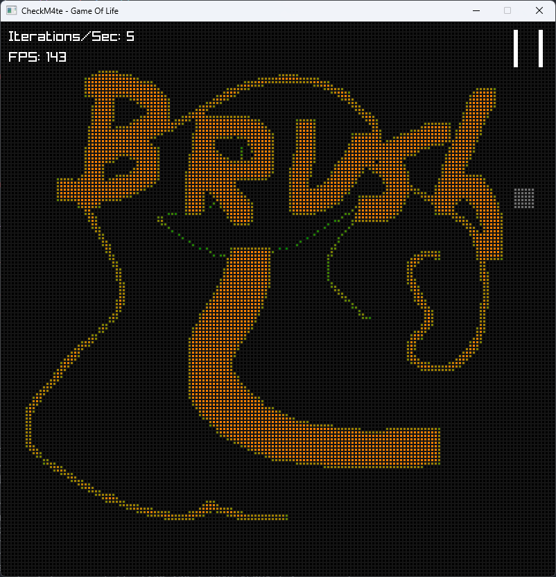

# checkm4te's rusty game of life
A simple (probably really inefficient) and lightweight (<1MB!) implementation of Conway's game of life written in Rust and rendered using Raylib. It includes a world editor where you can add/remove cells (paint-like, with brush size), zoom in/out, set iterations/s, and pause the simulation.

RIP John Horton Conway.

The cells are color coded, from green to orange, where dark green is 0 neighbors, and orange 8 neighbors.

## controls
- Pause with space
- Add cells with left click, remove with right click
- Zoom in/out with CTRL+Mouse wheel
- Set simulation speed with Mouse wheel
- Set brush size with SHIFT+Mouse wheel
- Enable or disable the grid outline with G (if you disable it only live and highlighted cells will be rendered, improving performance!)
- Clear the grid with C
- Randomize cells with R.
- Move camera with middle mouse button

## building
```bash
cargo build --release # release for faster runtime
```

## why
To learn rust. I already made an [implementation in Go](https://github.com/checkm4ted/gameoflife) (If you just want a working game of life use that one, it has more features and somehow better performance, also it only renders visible cells giving +200 FPS with millions of cells!), and wanted to try with Rust. In all my past rust projects I only used a single thread (the main one). In this one I had to use more.

## screenshots
!



## special thanks
- The nice people at [Rust Discord](https://discord.gg/rust-lang-community), specially HomelickeBrick42, for helping me fix borrower issues regarding multithreading.  (I was going to quit this project but they made it possible) 
- The Raylib library.